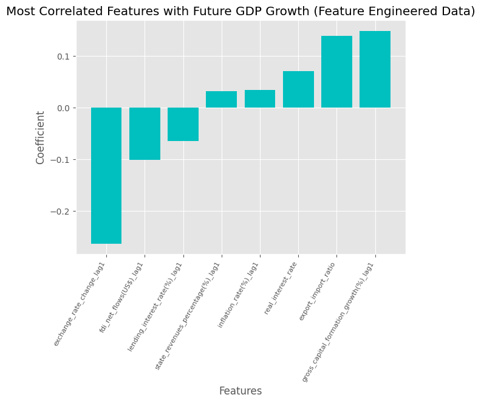
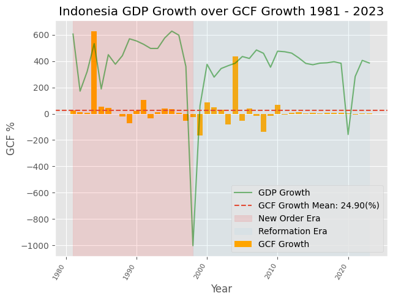

# Indonesia GDP Growth Analysis

An end-to-end macroeconomic forecasting and policy-simulation project focused on one question:

## 🔍 Problem to Solve
Indonesia's GDP follows the classic identity:

`GDP = C + I + G + (X-M)`

But when growth needs to accelerate, which component actually moves the needle?

This project goes beyond simple forecasting. It treats GDP growth as a decision problem:

- Which indicators matter most for next-year growth?
- Which variables are just large in size, but weak in predictive power?
- What realistic policy targets could move Indonesia closer to 6% growth?

The final output is a notebook-driven forecasting and prescriptive analysis workflow built from historical macroeconomic data and translated into concrete growth scenarios.

## ⚙️ What I Did
I built this as a full data science pipeline rather than a one-off model experiment.

### 1. Problem Definition
- Framed GDP growth as both a predictive and prescriptive problem
- Predictive goal: estimate next-year GDP growth
- Prescriptive goal: simulate target-setting scenarios that could improve growth outcomes

### 2. Data Collection
- Compiled historical Indonesia macroeconomic indicators covering roughly 1980-2023
- Built the modelling dataset around lagged predictors so each year's GDP growth is explained by prior-year macro conditions

Main indicators include:

- GDP growth
- Household consumption
- Gross capital formation growth
- Export and import values
- FDI net inflows
- Inflation
- Lending interest rate
- Exchange rate
- Tax revenue and state revenue ratios
- Labor-market proxy variables such as unemployment and under-earning share

### 3. Data Inspection and Understanding
- Inspected each variable's economic meaning and time dependency
- Reviewed missing-value patterns and identified which gaps could be interpolated versus model-imputed
- Prepared lagged GDP features to preserve temporal structure

### 4. Data Cleaning
- Used interpolation for suitable continuous series
- Used regression-based imputation for more complex missing fields
- Built a cleaned lagged dataset for modelling: [cleaned_gdp_growth_lag1.csv](/Users/zhakim/Documents/ML_Project/gdp_growth_analysis/cleaned_gdp_growth_lag1.csv)

### 5. Feature Engineering
- Created economically meaningful features instead of relying only on raw columns
- Added `real_interest_rate`
- Added `exchange_rate_change_lag1`
- Added `export_import_ratio`

The final engineered dataset is stored in [feature_engineered_gdp_growth_lag1.csv](/Users/zhakim/Documents/ML_Project/gdp_growth_analysis/feature_engineered_gdp_growth_lag1.csv).

### 6. Feature Selection
- Compared correlations between macro indicators and GDP growth
- Reduced multicollinearity
- Kept the variables that were most useful for next-year growth signal extraction

### 7. Model Training
- Benchmarked `LinearRegression`, `Lasso`, and `Ridge`
- Evaluated both unscaled and scaled pipelines
- Final saved production-style pipeline uses feature engineering inside the pipeline
- Included mean imputation fallback for missing values
- Scaled features with `RobustScaler`
- Trained the final estimator with `Ridge(alpha=50)`

Note:
- The saved artifact is named [gdp_lasso_model.pkl](/Users/zhakim/Documents/ML_Project/gdp_growth_analysis/gdp_lasso_model.pkl) for legacy naming reasons, but the fitted final model inside the pipeline is Ridge.

### 8. Model Evaluation
- Used a time-aware split from historical observations rather than random shuffling
- Final pipeline test performance from the notebook:
- `MAE = 0.77`
- `RMSE = 2.13`

This is a major improvement over earlier baseline experiments in the notebooks, where MAE was above `3.9` before the stronger preprocessing and pipeline design.

### 9. EDA and Decision Analysis
I split the analysis into three layers:

- Descriptive: what happened historically
- Predictive: what 2026 growth looks like under baseline assumptions
- Prescriptive: what targets may be needed to approach or exceed 6%

## 📊 Key Insights

### 1. Consumption is large, but not the strongest accelerator
Household consumption is economically important, but in this project it was not the cleanest growth lever for acceleration. It matters, but not as strongly as investment and trade efficiency signals.

### 2. The strongest growth drivers are investment and external balance
The most actionable signals were:

- Gross capital formation growth
- Export-to-import dynamics
- FDI support

This suggests growth acceleration is more sensitive to productive investment and trade strength than to consumption expansion alone.

### 3. Inflation and exchange-rate stability behave like silent gatekeepers
Even when they are not the headline variables, inflation and exchange-rate behavior shape the environment in which growth drivers can work effectively.

### 4. Lagged GDP still matters
Previous growth performance remains informative, which is expected in macro time series where momentum and recovery cycles matter.

## 🚀 Prescriptive Impact
This is the part that makes the project practical.

Instead of stopping at a forecast, I used the trained model to simulate target-setting scenarios for 2026 growth using 2025-style input assumptions.

### Baseline Forecast
Using the baseline scenario in the notebook, the model predicts:

- `Expected 2026 GDP Growth: 5.54%`

### Moderate Scenario
The moderate scenario improves several inputs together, including:

- Higher household consumption
- Higher FDI
- Higher gross capital formation growth
- Stronger exports

Notebook result:

- `Predicted GDP Growth: 5.69%`

Interpretation:
- Close to the 6% ambition, but still below target

### Aggressive Scenario
The more aggressive scenario pushes investment and export assumptions further.

Notebook result:

- `Predicted GDP Growth: 6.02%`

Interpretation:
- The 6% threshold becomes reachable when investment growth and export performance are both meaningfully strengthened

## Why This Project Stands Out
This project is not just "I trained a model on macro data."

It shows the ability to:

- Translate an economic question into a machine learning workflow
- Handle messy historical time-series data
- Build feature engineering tied to real economic logic
- Compare models instead of accepting the first result
- Turn a forecast into an actionable policy-style recommendation engine

For an HR or hiring audience, the strongest signal here is ownership across the full pipeline:

- business framing
- data cleaning
- feature engineering
- model comparison
- evaluation
- decision-oriented interpretation

## Visual Outputs
The project includes supporting charts in [visualisation](/Users/zhakim/Documents/ML_Project/gdp_growth_analysis/visualisation):

- GDP growth trend
- Correlation heatmaps
- GDP vs household consumption
- GDP vs gross capital formation
- GDP vs exchange rate
- GDP vs export-import ratio
- GDP vs FDI
- model fit comparison

Examples:





## Project Structure
```text
gdp_growth_analysis/
├── raw_data/
│   ├── source csv files
│   └── data_formatting.ipynb
├── data_cleaning.ipynb
├── feature_engineering.ipynb
├── modelling.ipynb
├── analysis.ipynb
├── formatted_gdp_growth_data.csv
├── cleaned_gdp_growth_lag1.csv
├── feature_engineered_gdp_growth_lag1.csv
├── gdp_lasso_model.pkl
└── visualisation/
```

## Notebook Guide
- [raw_data/data_formatting.ipynb](/Users/zhakim/Documents/ML_Project/gdp_growth_analysis/raw_data/data_formatting.ipynb): merges raw macroeconomic series and creates lag structure
- [data_cleaning.ipynb](/Users/zhakim/Documents/ML_Project/gdp_growth_analysis/data_cleaning.ipynb): handles missing values with interpolation and regression-based imputation
- [feature_engineering.ipynb](/Users/zhakim/Documents/ML_Project/gdp_growth_analysis/feature_engineering.ipynb): derives engineered macro features and narrows candidate predictors
- [modelling.ipynb](/Users/zhakim/Documents/ML_Project/gdp_growth_analysis/modelling.ipynb): compares models and builds the final pipeline
- [analysis.ipynb](/Users/zhakim/Documents/ML_Project/gdp_growth_analysis/analysis.ipynb): descriptive, predictive, and prescriptive analysis

## Tech Stack
- Python
- Pandas
- NumPy
- Matplotlib
- Seaborn
- scikit-learn
- Jupyter Notebook

## Limitations
- The dataset is small, so model stability is naturally constrained
- The workflow is notebook-first rather than packaged as a deployable Python module
- Some scenario values in the analysis are assumption-driven and should be treated as simulation inputs, not official forecasts
- A major shock year like 2020 is difficult for a compact linear model to capture cleanly

## Next Improvements
- Convert the notebook workflow into reusable Python scripts or a package
- Add explicit time-series cross-validation
- Version the final training pipeline more clearly
- Add sensitivity analysis for policy scenarios
- Wrap the model in a simple dashboard for decision-makers

## Final Takeaway
This project answers a meaningful economic question with a full-stack data science approach:

Indonesia is unlikely to reach 6% growth by relying on consumption alone. The stronger path, based on this analysis, comes from raising productive investment and improving net export strength while preserving macro stability.
