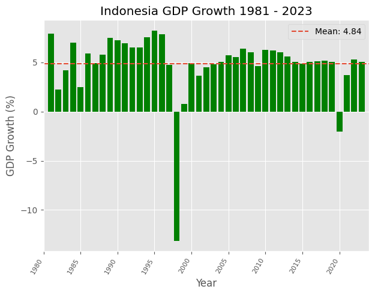

# Indonesia GDP Growth Analysis

This project analyzes Indonesia's annual GDP growth using a small macroeconomic time-series dataset built from public indicator files. The workflow moves from raw data formatting, to missing-value treatment, to feature engineering, to regression-based forecasting and scenario analysis.

The core project questions are:

1. Which macroeconomic indicators move most closely with Indonesia's GDP growth?
2. Can a simple, interpretable regression pipeline forecast GDP growth from prior-year conditions?
3. What combinations of macro improvements are associated with a path toward 6% GDP growth by 2027?

## Repository Layout

- `raw_data/`: source CSV files plus the raw data formatting notebook.
- `data_cleaning.ipynb`: imputes missing values, standardizes columns, and creates the lagged modelling dataset.
- `feature_engineering.ipynb`: creates derived macro features and exports the reduced modelling table.
- `modelling.ipynb`: benchmarks linear models and saves the final trained pipeline as `gdp_lasso_model.pkl`.
- `analysis.ipynb`: descriptive analysis, correlation review, 2026 forecast, and prescriptive scenario testing.
- `visualisation/`: exported charts used to summarize the analysis.

## Data Pipeline

The notebooks are intended to be read in this order:

1. `raw_data/data_formatting.ipynb`
   Builds the base Indonesia dataset by extracting and merging annual indicator series.
2. `data_cleaning.ipynb`
   Repairs missing values with interpolation and regression-based imputation, then creates lagged features.
3. `feature_engineering.ipynb`
   Engineers features such as `real_interest_rate`, `exchange_rate_change_lag1`, and `export_import_ratio`.
4. `modelling.ipynb`
   Compares `LinearRegression`, `Lasso`, and `Ridge`, then packages the best workflow into a reusable pipeline.
5. `analysis.ipynb`
   Uses the cleaned data and trained model for historical interpretation, forecasting, and what-if scenarios.

## Main Inputs

The merged dataset combines GDP growth with macro indicators such as:

- household consumption
- unemployment rate
- under-earning percentage
- inflation rate
- lending interest rate
- FDI net flows
- tax revenue
- state revenue
- gross capital formation growth
- import and export values
- IDR/USD exchange rate

## Main Outputs

- `formatted_gdp_growth_data.csv`: merged annual dataset before cleaning.
- `cleaned_gdp_growth_lag1.csv`: cleaned lagged dataset used for modelling.
- `feature_engineered_gdp_growth_lag1.csv`: reduced feature set after feature engineering and selection.
- `gdp_lasso_model.pkl`: trained forecasting pipeline saved from the modelling notebook.

## Modelling Approach

The project uses regularized linear models instead of heavier black-box models because the dataset is small and the goal is interpretability. The final workflow performs feature engineering inside a scikit-learn pipeline, scales the inputs, and fits a regression model to predict GDP growth from prior-year macro conditions.

## Public Notebook Notes

The notebooks in this repo have been cleaned for documentation use:

- markdown now explains what each section is doing and why it matters
- low-value inspection cells were removed
- code comments were rewritten for readability without changing the underlying logic

## Author

Zidane Taufiqul Hakim
